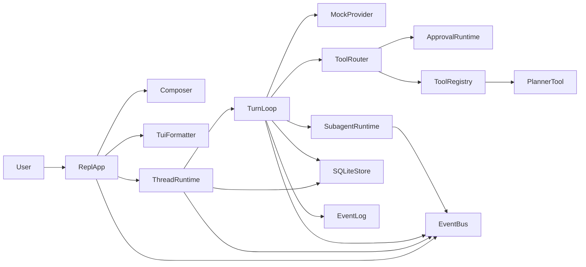
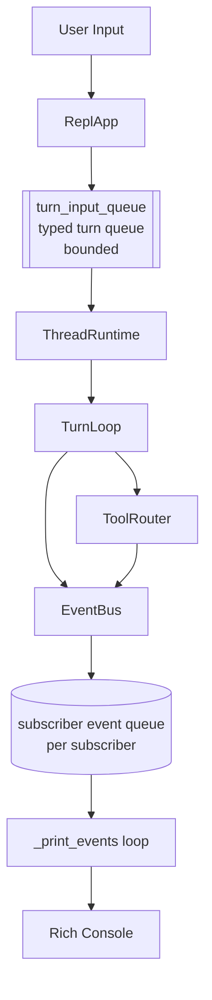
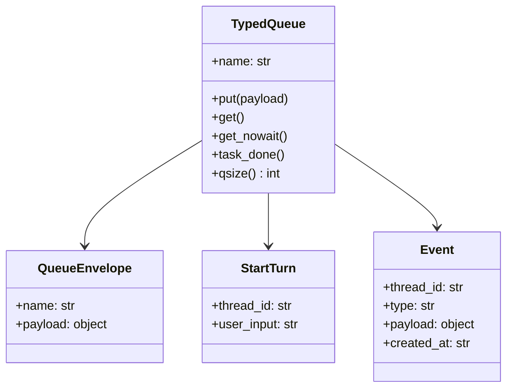
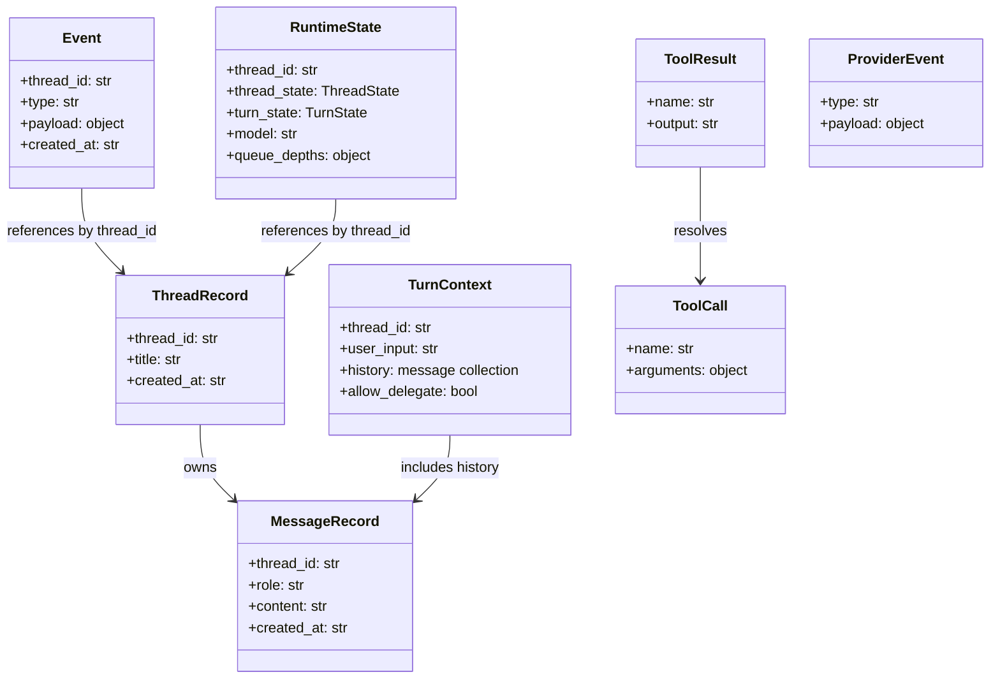
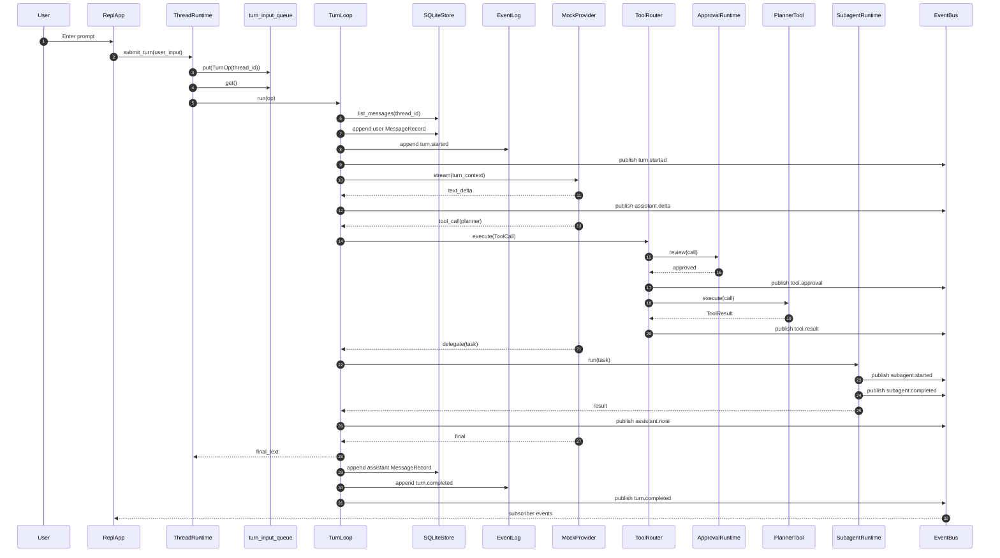
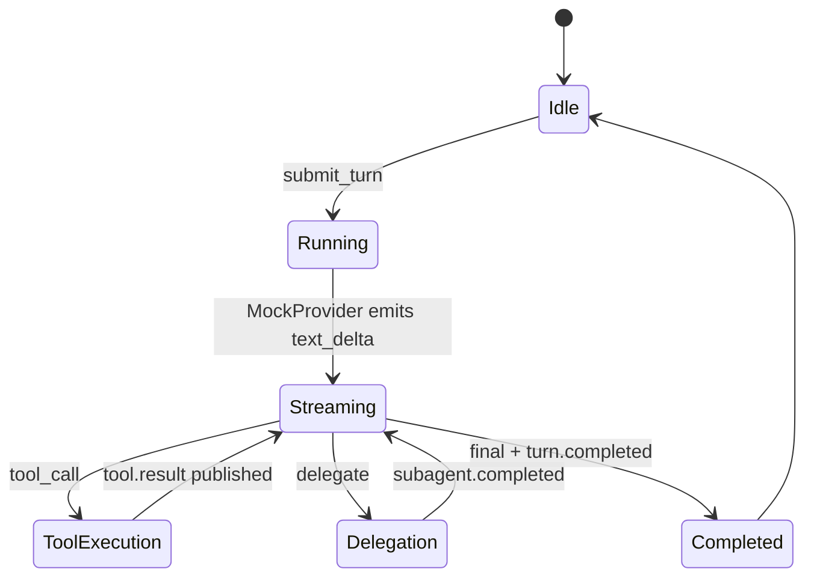
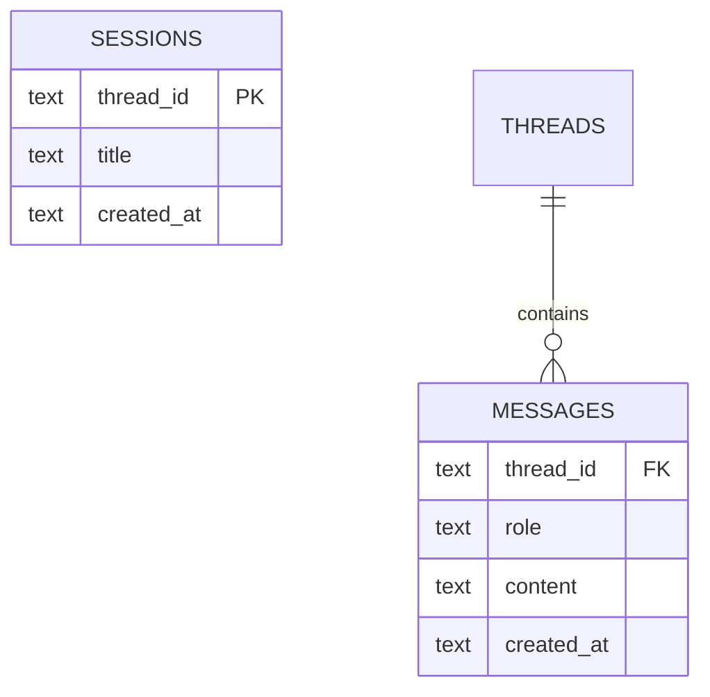
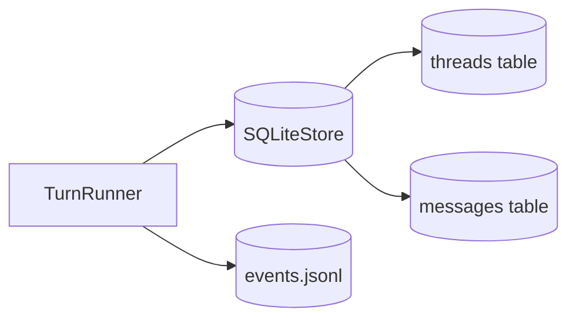

# anti-tech-debt-app Architecture

This document describes the architecture that is actually implemented in `src/anti_tech_debt_app/`.

## Core Actors



## Formal Class Comments

Here is the compressed markdown table organizing your components by their ownership, mutations, observations, and theoretical framings.

| Component | Owns | Mutates | Observes | Functional Framing | Category-Theoretic Framing |
| --- | --- | --- | --- | --- | --- |
| **ReplApp** | Interactive control flow for one local terminal surface; references to Composer, TuiFormatter, SlashCommands, StatusBar, and Container. | Starts and stops `ThreadRuntime` background tasks; no REPL-local thread selection remains. | EventBus subscriber stream, prompt input, slash commands, and latest runtime state. | An interpreter from user intent into runtime commands; operationally a stateful shell over an effectful stream. | A boundary morphism from terminal interactions to the internal runtime category; preserves ordering but not purity because it sequences side effects. |
| **Composer** | prompt-toolkit prompt session. | prompt-toolkit internal line-editing state only. | Raw user keystrokes and terminal input. | An effectful source of String values. | A producer object whose arrows yield user-input values in the IO category. |
| **TuiFormatter** | Rendering policy for welcome text, events, and status lines. | Console output only. | Event values and RuntimeState values. | Mostly a renderer from domain events to presentation artifacts. | A presentation functor from runtime-event structure to terminal-render structure; intentionally non-faithful because formatting drops internal detail. |
| **ThreadRuntime** | Thread lifecycle entrypoints, active-thread ownership, and the inbound turn queue loop. | Active thread selection, queue consumption progress, and background task registry. | Turn operations from the inbound queue and persisted thread rows. | A coordinator that composes user operations with turn execution. | A mediator object that composes arrows from command space into turn-execution space. |
| **TurnLoop** | One turn transaction boundary plus the canonical local runtime loop. | Persisted messages, event log entries, tool/subagent state transitions, and latest runtime state. | Prior message history, current user input, provider events, tool results, and subagent results. | A single effectful interpreter for turn execution. | A Kleisli arrow $TurnOp \to \text{Effect } TurnResult$, where effects include persistence and event emission. |
| **MockProvider** | Deterministic happy-path provider script. | Nothing outside its local coroutine progression. | TurnContext. | A pure scenario generator wrapped in async iteration. | A coalgebra for unfolding a finite stream of ProviderEvent values from one TurnContext seed. |
| **ToolRouter** | Tool dispatch policy and approval gate composition. | Published tool approval/result events. | ToolCall values, ApprovalRuntime decisions, and ToolRegistry results. | An effectful dispatcher $ToolCall \to ToolResult$. | A composition of two arrows, review and execute, with event emission as an attached writer-like effect. |
| **ApprovalRuntime** | Approval rule for whether a tool call is allowed. | No shared state in the current implementation. | ToolCall. | A predicate lifted into async form. | A boolean-valued morphism from tool-call objects into a two-point approval object. |
| **ToolRegistry** | Name-to-tool mapping. | No runtime state after construction in the current implementation. | `ToolCall.name` and tool-specific arguments. | A dictionary-backed dispatcher. | A small indexed family of morphisms selected by tool name. |
| **PlannerTool** | Planner behavior for the single built-in tool. | Nothing. | ToolCall arguments. | A total function from planner input to a ToolResult payload. | A pure morphism in the domain layer, merely lifted into async for uniformity. |
| **SubagentRuntime** | Delegated-task execution semantics for the scaffold. | `event_bridge` by publishing subagent lifecycle events. | Delegated task string and thread identifier. | A worker that returns a derived result while emitting progress events. | A product arrow $Task \to (\text{Event}^*, Result)$, approximated operationally with streamed events plus a returned value. |
| **EventBus** | Subscriber list and latest runtime state. | Subscriber registry and current runtime-state cache. | Event publications and RuntimeState publications from upstream actors. | In-memory pub-sub plus a last-value runtime-state cell. | A broadcast natural transformation from single event production into a family of subscriber queues. |
| **SQLiteStore** | Threads and messages persistence in SQLite. | `threads` table and `messages` table. | ThreadRecord and MessageRecord values passed in by higher layers. | Repository algebra for thread/message storage. | A persistence interpreter from domain records to durable relations. |
| **EventLog** | Append-only JSONL event history. | `events.jsonl`. | Event values. | A writer sink for replayable event history. | A Writer-like accumulator externalized as a file. |


## Core Queues And Event Channels

The runtime now has one explicit inbound typed queue. Tool execution and subagent execution are direct effects inside the canonical turn loop, and UI fanout happens through `EventBus`.



### Queue Semantics



## Core Entities



## Happy Path

This is the current end-to-end flow implemented by `ThreadRuntime`, `TurnLoop`, `MockProvider`, `PlannerTool`, and `SubagentRuntime`.



## Runtime State Path



## Database Model

The implemented SQLite schema is intentionally minimal.



## Persistence Model

SQLite is the source of truth for threads and messages. The JSONL event log is append-only debug and replay support.



## Actual Database Tables

```sql
create table if not exists threads (
  thread_id text primary key,
  title text,
  created_at text
);

create table if not exists messages (
  thread_id text,
  role text,
  content text,
  created_at text
);
```

## Notes On What Is Not Implemented Yet

- There is no HTTP or WebSocket server.
- There is no dedicated tool queue, approval queue, or subagent task queue yet.
- `EventBus` is in-memory pub-sub, not durable messaging.
- Only `planner` is wired into `ToolRegistry` in the default container.
- `OpenAICompatibleProvider` is a stub seam, not a working provider.
