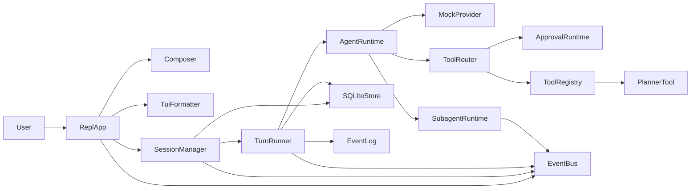
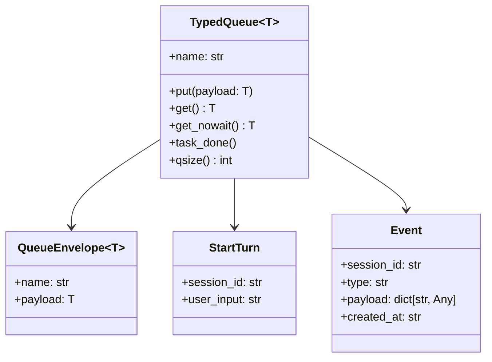
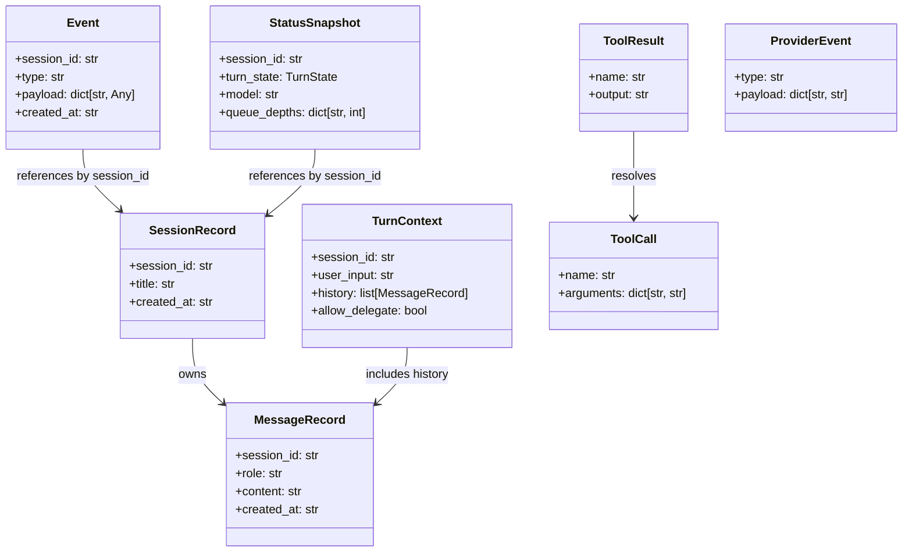
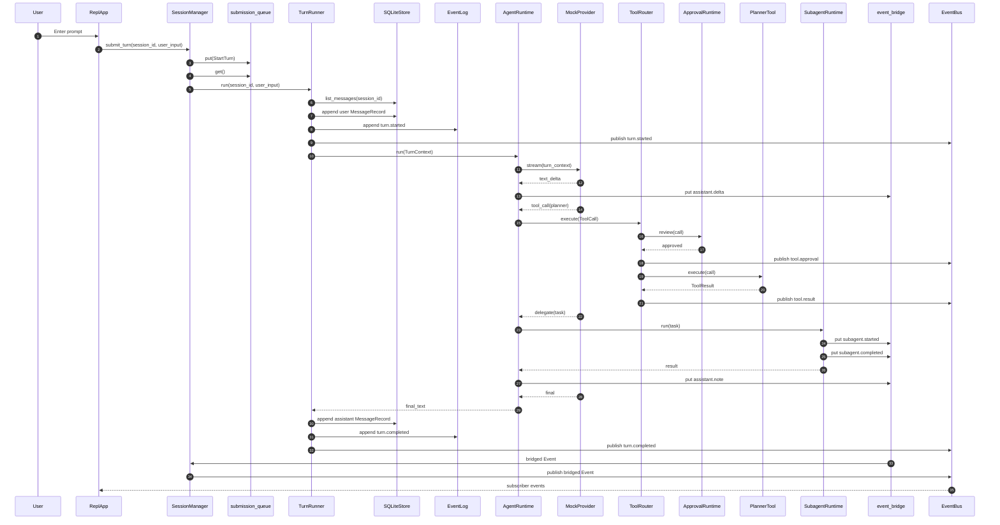
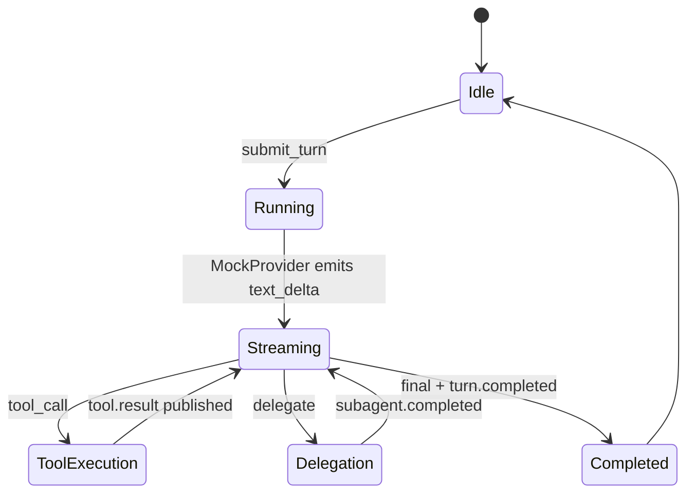
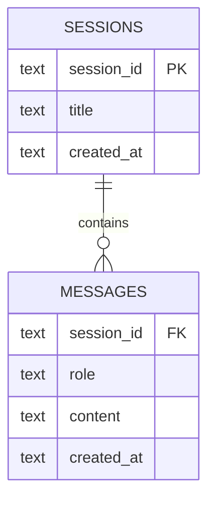
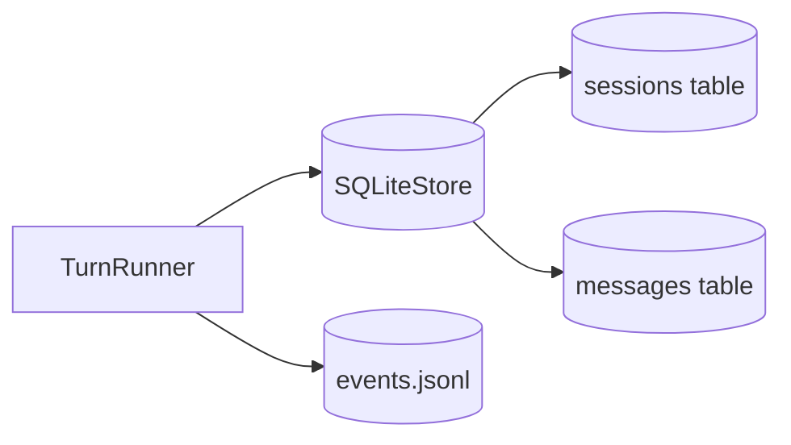

# anti-tech-debt-app Architecture

This document describes the architecture that is actually implemented in `src/anti_tech_debt_app/`.

## Core Actors



## Core Queues And Event Channels

Only two explicit typed queues are implemented today. Other interactions are direct async calls or pub-sub over `EventBus`.

```mermaid
flowchart TD
    User[User Input]
    Repl[ReplApp]
    SubmissionQ[[submission_queue<br/>TypedQueue[StartTurn]<br/>bounded]]
    SessionManager[SessionManager]
    TurnRunner[TurnRunner]
    AgentRuntime[AgentRuntime]
    ToolRouter[ToolRouter]
    EventBridge[[event_bridge<br/>TypedQueue[Event]<br/>bounded]]
    EventBus[EventBus]
    SubscriberQ[(asyncio.Queue[Event]<br/>per subscriber)]
    Printer[_print_events loop]
    Console[Rich Console]

    User --> Repl
    Repl --> SubmissionQ
    SubmissionQ --> SessionManager
    SessionManager --> TurnRunner
    TurnRunner --> AgentRuntime
    AgentRuntime --> ToolRouter
    AgentRuntime --> EventBridge
    EventBridge --> SessionManager
    SessionManager --> EventBus
    ToolRouter --> EventBus
    TurnRunner --> EventBus
    EventBus --> SubscriberQ
    SubscriberQ --> Printer
    Printer --> Console
```

### Queue Semantics



## Core Entities



## Happy Path

This is the current end-to-end flow implemented by `MockProvider`, `PlannerTool`, and `SubagentRuntime`.



## Runtime State Path



## Database Model

The implemented SQLite schema is intentionally minimal.



## Persistence Model

SQLite is the source of truth for sessions and messages. The JSONL event log is append-only debug and replay support.



## Actual Database Tables

```sql
create table if not exists sessions (
  session_id text primary key,
  title text,
  created_at text
);

create table if not exists messages (
  session_id text,
  role text,
  content text,
  created_at text
);
```

## Notes On What Is Not Implemented Yet

- There is no HTTP or WebSocket server.
- There is no dedicated tool queue, approval queue, or subagent task queue yet.
- `EventBus` is in-memory pub-sub, not durable messaging.
- Only `planner` is wired into `ToolRegistry` in the default container.
- `OpenAICompatibleProvider` is a stub seam, not a working provider.
