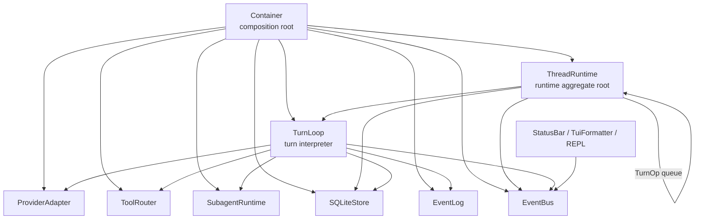
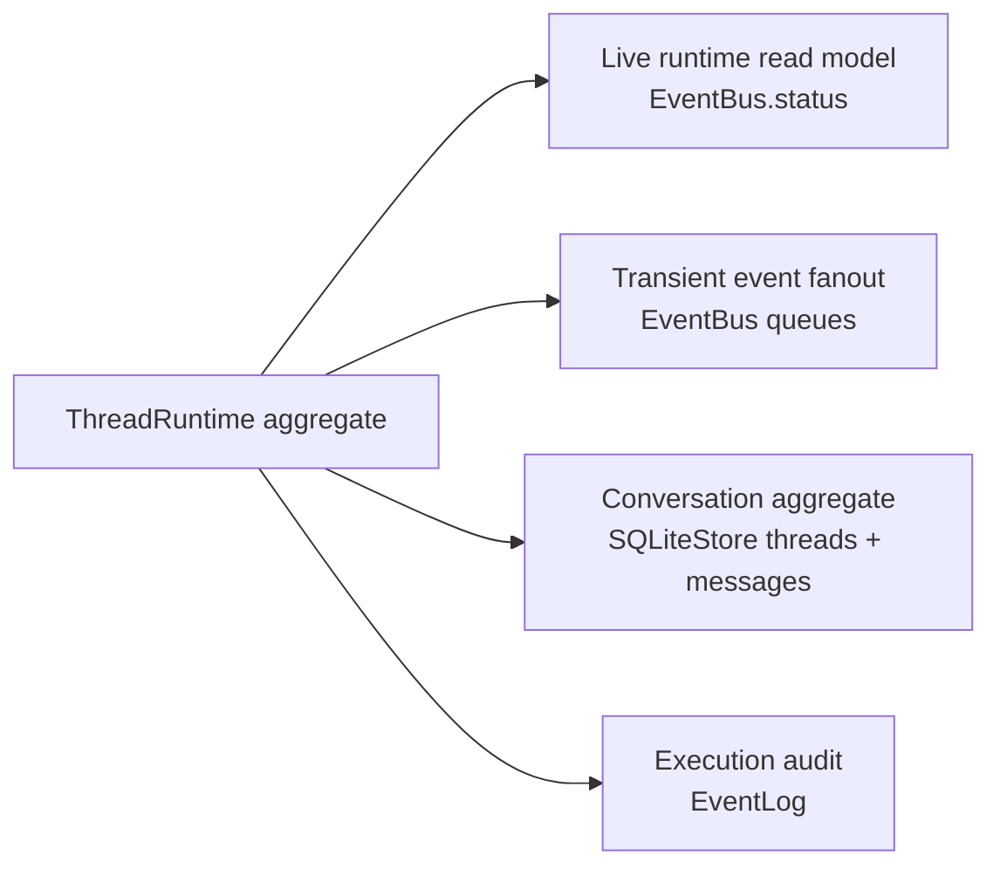
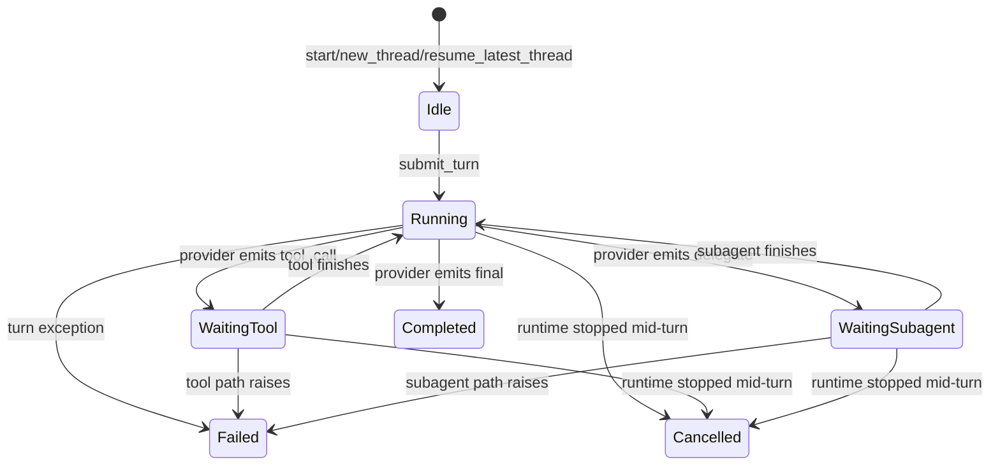
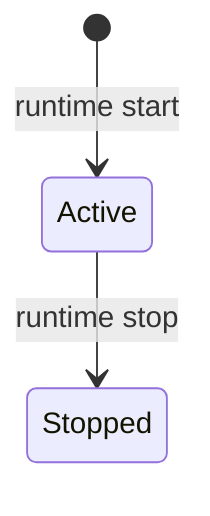
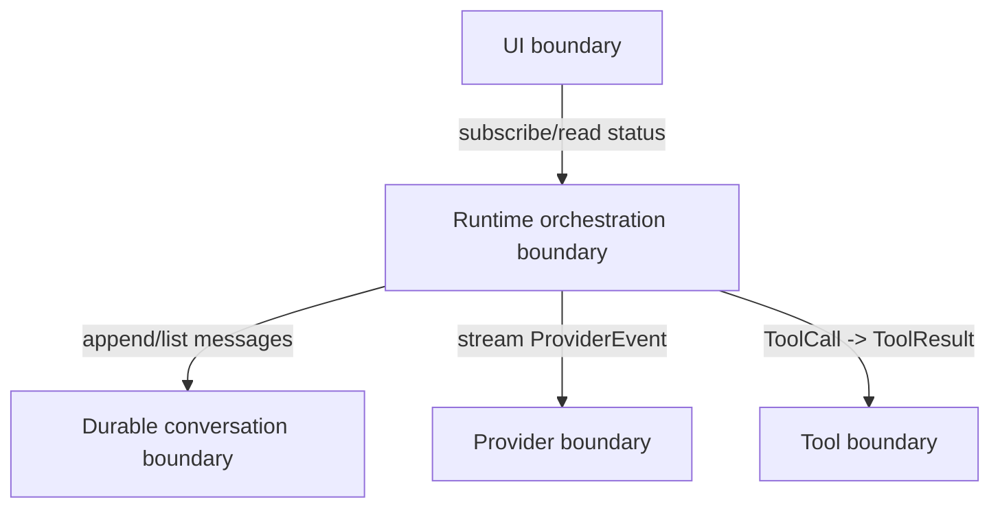
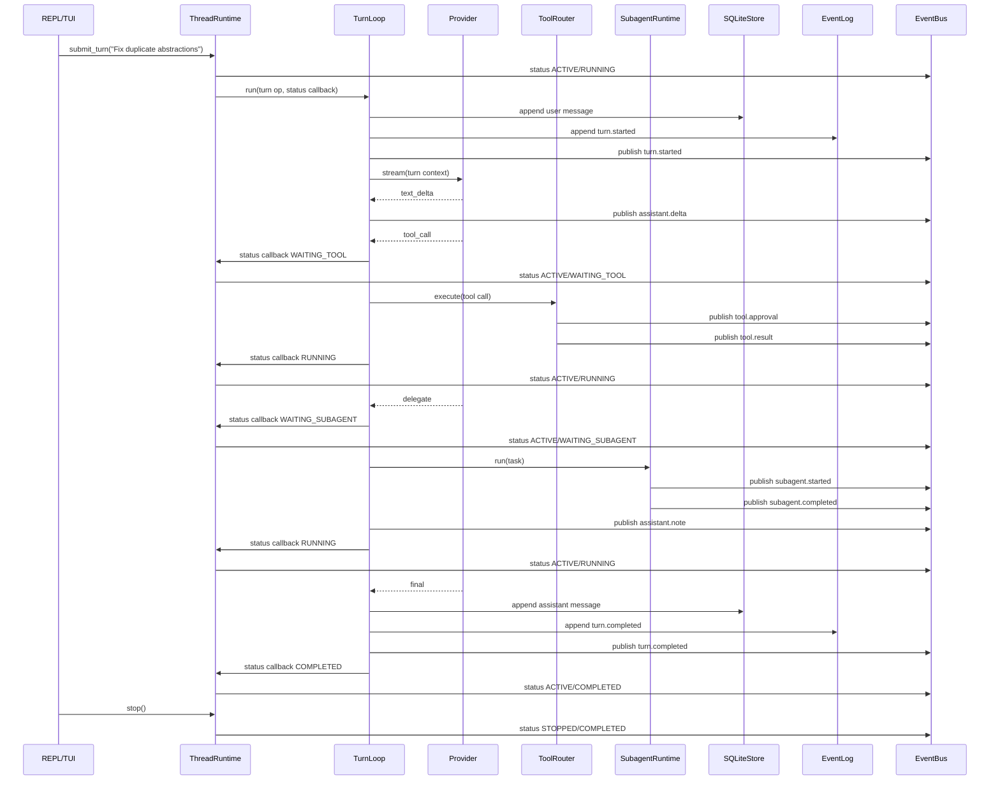

# Runtime System Map

This document captures the current local-runtime model after centralizing `RuntimeState` ownership in `ThreadRuntime`.

## Core Hierarchies

- `Container` wires concrete implementations only; it is not a state owner.
- `ThreadRuntime` is the runtime aggregate root for live execution state: active thread, worker lifecycle, queue draining, and the authoritative `RuntimeState` snapshot.
- `TurnLoop` is an interpreter for one turn. It owns sequencing and persistence side effects, but no longer owns the live status snapshot.
- `ToolRouter` and `SubagentRuntime` are subordinate effectors that emit runtime events but do not mutate status directly.
- `SQLiteStore`, `EventLog`, and `EventBus` are three distinct stores with different authority.

## Aggregates And Authorities

- `ThreadRuntime` is the only writer of `RuntimeState`.
- `SQLiteStore` is the durable source of truth for threads and messages.
- `EventLog` is a durable audit trail for coarse turn lifecycle events: `turn.started`, `turn.completed`, `turn.failed`.
- `EventBus.status` is a live in-memory projection for UI/runtime observers, not event sourcing and not an outbox.
- `EventBus` subscriber queues are transient transport only.

## States And Transitions

`TurnState` now has one explicit meaning: progress of the current or most recent turn for the active thread.

`ThreadState` is orthogonal to that:

- `ACTIVE + IDLE` means the runtime is running but not executing a turn.
- `ACTIVE + RUNNING|WAITING_*` means the worker is live and the active thread is mid-turn.
- `STOPPED + COMPLETED|FAILED|CANCELLED` preserves the terminal outcome of the last turn after shutdown.
- `STOPPED + IDLE` means the runtime stopped without an in-flight or completed turn.

## Boundaries And Contracts

### Contract Summary

- `ThreadRuntime`
  - Owns active-thread lifecycle, worker task lifecycle, queue draining, and `RuntimeState` publication.
  - Contract: any live status visible to UI must have been published through `ThreadRuntime`.
- `TurnLoop`
  - Owns one-turn sequencing, message persistence, event-log append, and transient event publication.
  - Contract: it may request turn-state changes through a callback, but it does not write `EventBus.status`.
- `EventBus`
  - Owns subscriber queues and the latest cached runtime snapshot.
  - Contract: transient in-process fanout plus cached latest status; not authoritative durable history.
- `EventLog`
  - Owns append-only durable lifecycle records.
  - Contract: replayable audit of turn lifecycle, not a complete event stream.
- `SQLiteStore`
  - Owns durable conversation state.
  - Contract: authoritative source for threads and messages.

## Happy Path

### Happy Path Narrative

- The user-facing runtime enters through `ThreadRuntime`.
- `TurnLoop` performs all effectful turn work but reports turn-phase transitions upward instead of owning status.
- The UI receives two streams of information:
  - transient events through `EventBus.subscribe()`
  - the latest snapshot through `EventBus.status`
- Shutdown changes only `ThreadState` and preserves the most recent terminal `TurnState`.

## Current Gaps

- `EventBus` still combines transient transport and cached latest snapshot. The write boundary is now clean, but the storage roles are still co-located.
- There is no unsubscribe path on `EventBus`, so long-lived UIs can accumulate stale subscriber queues.
- `EventLog` only records coarse lifecycle events, not every transient event published on the bus.
- Cancellation is runtime-local: stopping the worker marks the turn `CANCELLED`, but there is no richer cancellation handshake with provider/tool/subagent components.
