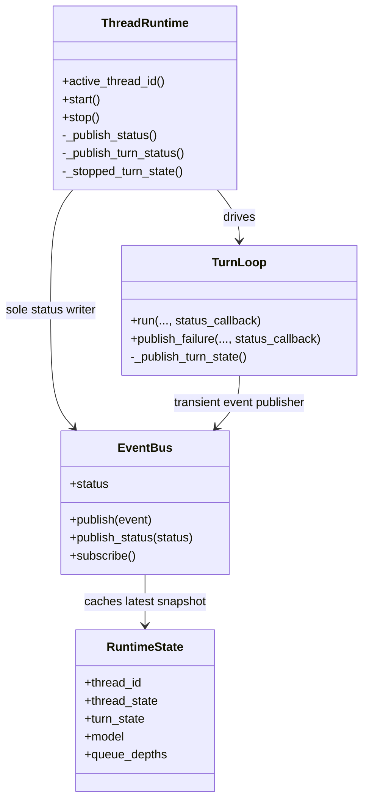
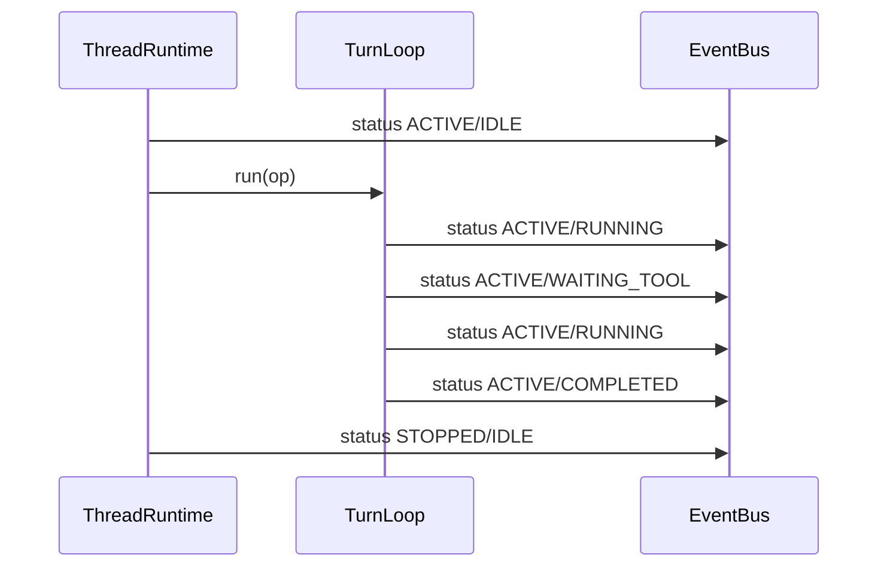
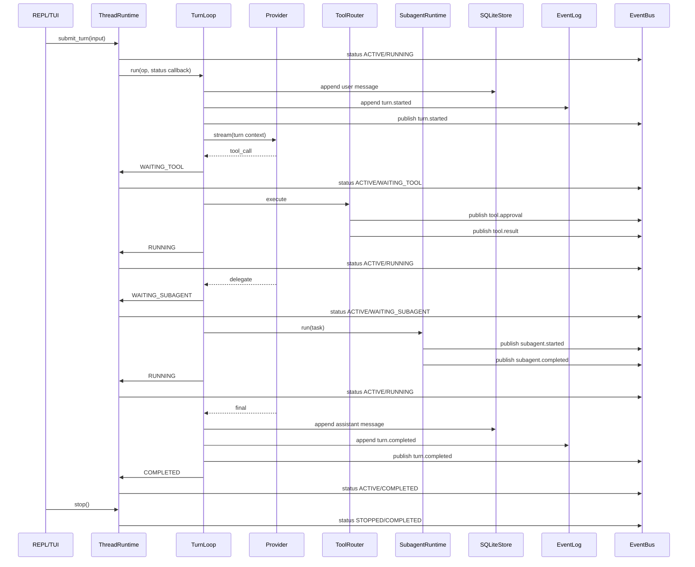

**Current state**

Relative to `dev`, this PR is currently `0 behind / 4 ahead` and now includes the latest `a875cb0 Unify runtime status ownership` on top of the earlier selective-port refactor and docs commits.

Net additions in the current head state:
- selective runtime ports for provider, store, tooling, approvals, and subagent execution
- centralized runtime status ownership in `ThreadRuntime`
- explicit status-transition coverage in runtime tests
- a new architecture note in `docs/runtime-system-map.md` with Mermaid diagrams for hierarchies, authorities, states, boundaries, and the happy path

**New additions**

The latest delta cleans up the most load-bearing state contradiction in the branch:
- `TurnLoop` no longer writes `EventBus.status` directly
- `ThreadRuntime` is now the sole writer of `RuntimeState`
- shutdown preserves terminal turn outcomes and marks in-flight work as `cancelled`
- `StatusBar` now surfaces both `thread_state` and `turn_state`
- dead `WAITING_APPROVAL` turn-state vocabulary has been removed

Across the full PR, the repo is moving toward selective runtime boundaries without introducing broad interface layers everywhere. The volatile seams are now concentrated in the provider/store/tool/subagent boundaries, while orchestration remains concrete.

**New entities**

No new domain aggregates were introduced in the latest commit. The important new relation is behavioral: `ThreadRuntime` now owns the live status projection, while `TurnLoop` emits turn-phase intent via a callback.

**Type product / category-theory framing**

The important product in this diff is still `RuntimeState = (thread_id, thread_state, turn_state, model, queue_depths)`, but its construction is now localized. Before this change, two effectful arrows were constructing the same product independently: `TurnLoop -> EventBus.status` and `ThreadRuntime -> EventBus.status`. After this change, `TurnLoop` only emits turn-phase observations, and `ThreadRuntime` folds them into one canonical runtime snapshot.

That is a better composition boundary: the interpreter for turn execution is no longer also the producer of the durable-ish live read model.

**New functionality category-theory framing**

The new functionality is a cleaner factorization of the runtime arrow:

`TurnOp -> TurnLoop side effects + TurnState callbacks -> ThreadRuntime status projection -> EventBus.status`

Previously the turn interpreter both executed the turn and projected live status. Now the turn interpreter remains effectful, but the status projection is factored upward into the runtime owner that already owns active thread lifecycle and shutdown semantics.

**New functionality ownership / mutation / correctness table**

| Functionality | Owner | Primary mutator | Enforcer for correctness | Notes |
| --- | --- | --- | --- | --- |
| Active-thread lifecycle | `ThreadRuntime` | `ThreadRuntime` | `tests/test_thread_runtime.py` | Start/resume/stop semantics remain concrete runtime behavior. |
| Live runtime snapshot | `ThreadRuntime` | `ThreadRuntime._publish_status()` | `tests/test_happy_path.py`, `tests/test_thread_runtime.py` | `EventBus.status` now has one writer. |
| Turn execution sequencing | `TurnLoop` | `TurnLoop` | `tests/test_runtime_ports.py` | `TurnLoop` still owns message persistence, tool/subagent orchestration, and lifecycle events. |
| Turn-phase signaling | `TurnLoop` | `status_callback` invocations from `TurnLoop` | `tests/test_runtime_ports.py` | The callback transmits phase changes without letting `TurnLoop` own the read model. |
| Shutdown terminal-state preservation | `ThreadRuntime` | `ThreadRuntime.stop()` | `tests/test_thread_runtime.py`, `tests/test_happy_path.py` | `completed`/`failed` survive stop; in-flight work becomes `cancelled`. |

**How the code works now**

The load-bearing paths are:
- `src/anti_tech_debt_app/runtime/thread.py`: owns the worker task, active thread id, merged status publication, and stop semantics
- `src/anti_tech_debt_app/runtime/turn_loop.py`: owns one-turn sequencing, persistence, event-log writes, and transient event publication
- `src/anti_tech_debt_app/tui/status_bar.py`: now renders `thread_state` alongside `turn_state`
- `tests/test_runtime_ports.py`, `tests/test_thread_runtime.py`, `tests/test_happy_path.py`: define the runtime-state contract more explicitly than before
- `docs/runtime-system-map.md`: documents the resulting aggregates, states, transitions, boundaries, and happy path

The resulting behavior is:
1. `ThreadRuntime` starts/resumes a thread and publishes `ACTIVE/IDLE`.
2. `TurnLoop.run()` persists the user message, emits lifecycle events, and reports turn phases through a callback.
3. `ThreadRuntime` converts those phase signals into the sole authoritative `RuntimeState` snapshot.
4. `TurnLoop` still publishes transient bus events and appends coarse lifecycle records to `EventLog`.
5. `ThreadRuntime.stop()` changes `thread_state` to `STOPPED` while preserving terminal turn outcomes or mapping in-flight work to `CANCELLED`.

**Testing coverage**

| Test / Command | Coverage rating | Behavior protected | Notes |
| --- | --- | --- | --- |
| `.venv/bin/python -m py_compile ...` on edited runtime, tui, and test files | 4/10 | Guards against syntax/signature regressions in the touched files | Structural only; no behavior coverage. |
| Direct async validation script invoking `test_turn_loop_accepts_fake_ports_and_persists_result()` | 8/10 | Protects the happy path turn-phase sequence, persisted assistant output, tool call wiring, subagent wiring, and lifecycle events | Executed directly because local `pytest` crashes during bootstrap. |
| Direct async validation script invoking `test_turn_loop_publish_failure_reports_failed_status()` | 8/10 | Protects failed-turn status signaling through the callback path | Confirms `FAILED` is projected when failure is published. |
| Direct async validation script invoking `test_thread_runtime_start_creates_active_thread()` and `test_thread_runtime_start_resumes_latest_thread()` | 7/10 | Protects initial active-thread selection and `ACTIVE/IDLE` startup status | Covers lifecycle baseline. |
| Direct async validation script invoking `test_thread_runtime_stop_preserves_completed_turn_state()` | 8/10 | Protects the user-visible contract that shutdown preserves `completed` rather than reverting to `idle` | This is the bug the latest commit fixes. |
| Direct async validation script invoking `test_thread_runtime_stop_marks_in_flight_turn_cancelled()` | 7/10 | Protects mid-flight shutdown semantics | Uses a blocking fake provider to prove `cancelled` behavior. |
| Direct async validation script invoking `test_turn_happy_path()` | 8/10 | Protects end-to-end local happy path: events, persistence, and final stopped/completed snapshot | Strongest integration coverage in this diff. |
| `pytest` in this environment | 1/10 | Intended to protect the normal test-runner path | Currently blocked: local interpreter segfaults in `_pytest.capture._readline_workaround()` on `import readline` before collection. |

**Gaps / critique**

| Gap / critique | Urgency | Why it matters | Suggested follow-up |
| --- | --- | --- | --- |
| `EventBus` still co-locates transient fanout and cached status projection | 5/10 | The write boundary is cleaner now, but transport and read-model concerns are still coupled in one runtime object | Keep as-is for v1, or later split `status` into a dedicated projection/store if richer runtime semantics or multi-client consumption arrive. |
| `EventLog` remains a coarse lifecycle audit, not a full replay stream | 4/10 | Reviewers could still over-assume replay fidelity because live bus events and durable audit events diverge | Document this explicitly in README or architecture docs whenever replay semantics come up. |
| `EventBus` has no unsubscribe path | 4/10 | Long-lived terminals or repeated subscribers can accumulate stale queues | Add unsubscribe support when the REPL lifecycle becomes longer-lived or multi-view. |
| Validation is blocked through normal `pytest` bootstrap on this machine | 7/10 | CI and local developer ergonomics depend on a working test runner, and the current branch already shows failing checks | Fix the local Python/readline environment or run CI-backed verification before merge. |
| `CANCELLED` is a local stop-time projection, not a full cooperative cancellation protocol | 3/10 | Good enough for this scaffold, but external providers/tools would need stronger cancellation semantics later | Defer until real cancellable tool/provider work exists. |

**Styling / refactoring proposals**

| Proposal | Proposal priority | Reason | Scope |
| --- | --- | --- | --- |
| Alias the status callback to a small concrete callable type in a shared runtime module if more status-producing components appear | 4/10 | Keeps the callback contract discoverable if the runtime grows another status producer | Small runtime cleanup only if needed later. |
| Add a small note in `docs/runtime-system-map.md` that `EventBus.status` is convenience state rather than durable authority | 3/10 | Prevents later readers from interpreting the bus as event sourcing or an outbox | Documentation-only polish. |

**Previous architecture**

The problem in the prior flow is that `ThreadRuntime` and `TurnLoop` both wrote the same `RuntimeState` cell with different semantics.

**Final architecture**

**Closing read**

The strongest part of the latest commit is that it resolves a real semantic contradiction instead of just changing a test expectation. The branch now has a defensible answer to “who owns live runtime state?” without over-abstracting the rest of the orchestration. The remaining issues are mostly architectural debt already acknowledged in the docs: `EventBus` still mixes transport and cached projection, `EventLog` is not authoritative replay, and the normal `pytest` bootstrap path is currently broken in this local environment.
